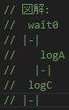
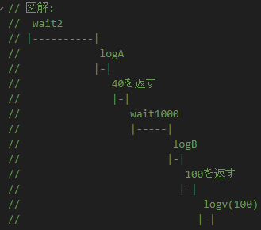
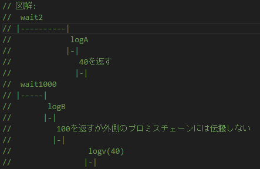
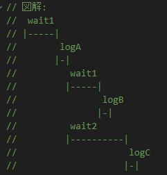
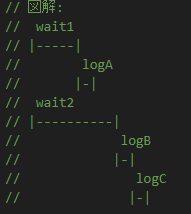
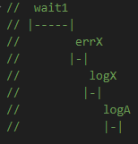
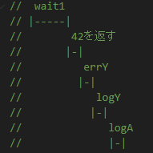
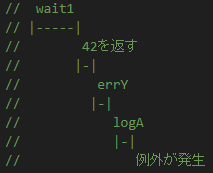

# f3

### 回答

- C 、A という順にすぐに出力される

### 説明

- try/catch/finally文は同期的に実行されるので、logAよりlogCが先に実行される。
- 非同期で動いているerrXで例外をスローしても、catch節は呼び出されないので、logBは実行されない

### 図解



# f4

### 回答

- 2秒後に A が出力され、その1秒後に B が出力され、そのすぐ後に 100 が出力される。

### 図解



# f5

### 回答

- 1秒後に B が出力され、さらに1秒後に A　が出力され、そのすぐ後に 40が出力される。

### 説明

- 2番目のthenメソッドにはコールバック関数ではなくPromiseが渡されているのでこの部分は非同期で動かず、すぐに1秒のカウントが始まる。また、返される 100 という値は外側のthenメソッドには伝搬しない

### 図解



# f6

### 回答

- 1秒後に A が出力され、さらに1秒後に B が出力され、さらに1秒後に C が出力される

### 説明

- p.then() を2回呼び出すと、それらは同期的に実行される

### 図解



# f7

### 回答

- 1秒後に A が出力され、さらに1秒後に B が出力され、そのすぐ後に C が出力される

### 説明

- 解決済みの Promise の then を呼び出すと、then の中身はすぐに実行される

### 図解



# f8

### 回答

- 1秒後に X が出力され、そのすぐあとに A が出力される

### 説明

- errX で例外がスローされると、catchメソッドまでチェーンをおりていき、そこで X が出力される。catchメソッドより前にある errY のthenメソッドは無視される。
- finallyメソッドは最後に必ず実行される。

### 図解



# f9

### 回答

- 1秒後に Y が出力され、そのすぐあとに A が出力される

### 説明

- 最初のthenメソッドは42を返すが何もコンソール出力はしない
- 次のthenメソッドの errY で例外がスローされ、catchメソッドで Y が出力される
- finallyメソッドは最後に必ず実行される。

### 図解



# f10

### 回答

- 1秒後に A が出力され、その後すぐにエラーでプログラムが止まる。

### 説明

- `then(r).catch(c)`と同じ動きをするのは、`then(r,c)`ではなく、`then(r).then(null,C)`である

### 図解



# f11

### 回答

- すぐに X が出力される

### 説明

- PromiseコンストラクタでPromiseオブジェクトを作っているので、catchメソッドで例外をキャッチできる

# f12

### 回答

- 例外がキャッチできずにプログラムが止まる

### 説明

- タイマーの部分を以下のように修正すればキャッチできる

````
setTimeout(() => {
      try {
        errX();
      } catch (e) {
        reject(e);
      }
    }, 0);
    ```
````
