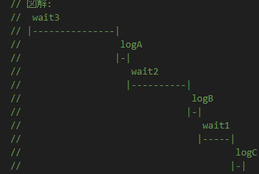

# h1

### 回答

- 3秒後に A が出力され、その2秒後に B が出力され、その1秒後に C が出力される

### 説明

- エラーが発生しないので、catchメソッドは実行されない

### 図解



# h2

### 回答

- x が出力される

# h3

### 回答

- エラーXが発生して、プログラムが止まる

### 説明

- async関数は、もとの関数をラップしてPromiseを返すようにした関数と考えることができる
- async関数の中で発生した例外は、async関数の中でキャッチして処理する必要がある
- このように書けばキャッチできる

```
  new Promise(async () => {
    try {
      errX();
    } catch (e) {
      log(e.message);
    }
  }).catch((e) => log(e.message));
```

### 図解

# h4

### 回答

- どちらの例外もキャッチできない

### 説明

- 基本的には、最初に発生した例外のみがキャッチされる
- 両方ともキャッチできない理由としては、
  - p1 : 2秒後に errY( ) を呼び出し 、p2 : 1秒後に errX( ) を呼び出し（err (x) が先に呼ばれる）
  - awaitの記述は上記の待ち時間の順番と逆になっている（await p1 →　await p2）
  - await p1 でp1を待っている間に、先にエラーYがスローされる
  - p2はまだawaitなしの状態なので、同期的に処理されているため、p2の処理を待つことなくcatchメソッドの処理も実行されてしまっているので、エラーYはキャッチできず、エラーが発生する。
  - await p1 と await p2 を逆にすると、エラーYだけキャッチできる
