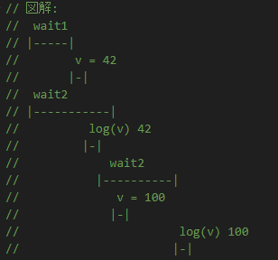
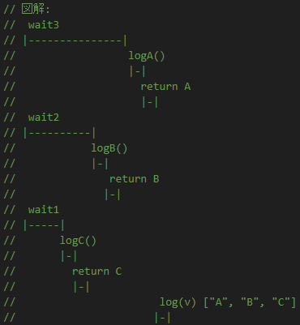
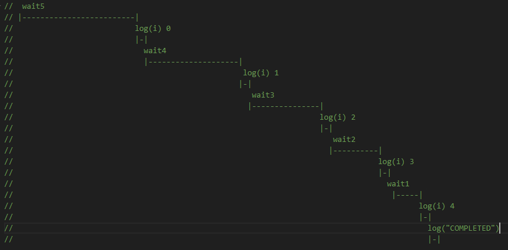
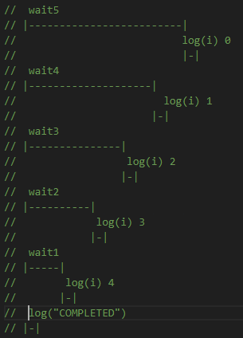
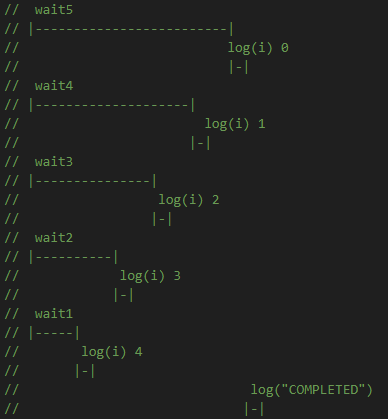
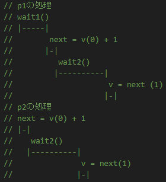

# i1

### 回答

- 1秒後に 42 が出力され、その2秒後に 100 が出力される

### 説明

- Promise.anyメソッドは入力としてプロミスの反復可能オブジェクトを取り、単一の Promise を返します。この返されたプロミスは、入力のプロミスのいずれかが履行されたときに、この最初の履行値で履行されます。([MDN](https://developer.mozilla.org/ja/docs/Web/JavaScript/Reference/Global_Objects/Promise/any)から引用)
- 1秒後に1つ目のプロミス(wait1()...)が満たされるので、vは42となる
- log(v)で42が出力される
- ただし、2つ目のプロミス(wait2()...)の実行は止まらず、2秒後に満たされて、vは100となる
- その後 await wait2() で2秒待つ
- 最後のlog(v)では100が出力される

### 図解

# i2

### 回答

- 1秒後に C が出力され、その1秒後に B が出力され、その1秒後に A が出力され、そのすぐ後に[ 'A', 'B', 'C' ]が出力される

### 説明

- Promise.allは引数としてPromiseオブジェクトの配列を受け取り、Promiseオブジェクトを返す。
- 引数として渡されたPromiseオブジェクトは平行処理される
- 引数として渡された全てのPromiseが満たされると各Promiseを満たした値の配列で、返されたPromiseが満たされる

### 図解

# i3

### 回答

- 1秒後に Y が出力され、そのすぐ後に 42 が出力され、その1秒後に B が出力され、その2秒後に 0 が出力される

### 説明

- Promise.allは引数としてPromiseオブジェクトの配列を受け取り、Promiseオブジェクトを返す。
- 引数として渡されたPromiseオブジェクトは平行処理される
- 引数として渡されたPromiseのいずれかが失敗した場合、返されたPromiseは失敗する
- 返されたPromiseが失敗したら、catchメソッドの処理に移るが、他のPromiseの処理は止まるわけではない。
- 返されたPromiseはすでに失敗しているので、新たに満たされたり、別の失敗となることはない。

### 図解

# i4

### 回答

- 5秒後に 0 が出力され、その4秒後に 1 が出力され、その3秒後に 2 が出力され、その2秒後に 3 が出力され、その1秒後に 4 が出力され、そのすぐあとに COMPLETED が出力される

### 説明

### 図解

# i5

### 回答

- すぐに COMPLETED が出力され、それから1秒おきに 4,3,2,1,0 が順番に出力される

### 説明

- p.then()に関数ではなく式を渡しているので非同期に動かないため

### 図解

# i6

### 回答

- 1秒おきに 4,3,2,1,0 が順番に出力され、そのすぐあとに COMPLETED が出力される

### 説明

- Promise.allは渡されたプロミスを並行処理する
- すべてのPromiseが満たされると、Promise.allが返すPromiseオブジェクトも満たされるので、COMPLETED は最後に出力される

### 図解

# i7

### 回答

- 11秒後に 10 が出力される

### 説明

- Promise.allは並行して渡されたPromiseオブジェクトの処理を行うので、遅い方(p1)の処理時間である11秒後に満たされる
- valueの値に+1する処理を、p1とp2で5回ずつ行っているため最終的にvalueの値は10になる

# i8

### 回答

- 11秒後に 5 が出力される

### 説明

- Promise.allは並行して渡されたPromiseオブジェクトの処理を行うので、遅い方(p1)の処理時間である11秒後に満たされる
- p1とp2でぞれぞれvalueの値を読んでから、2秒待って+1している。
- p1とp2でvalueに対する処理は1秒ずつずれて行われているため、片方で+1された結果はもう片方には反映されず、最終的にvalueの値は5になる

### 図解

- forループ1周目の処理を図解するとこのようになる。1ループ目が終わったときはvは1である。  
  
