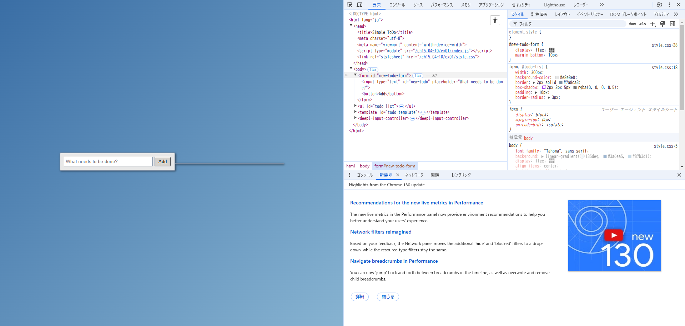
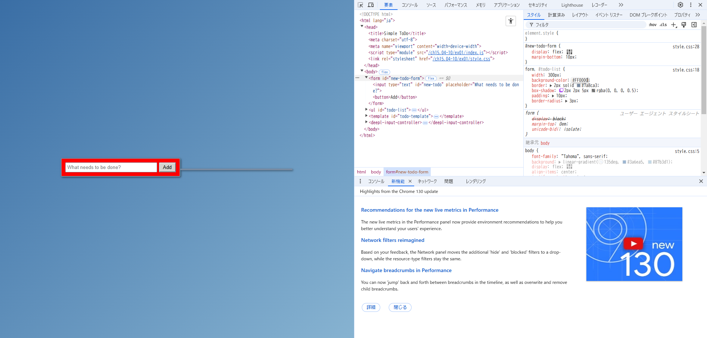
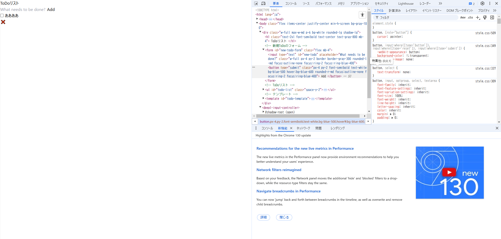

# 15.4-10.1 および 15.4-10.2 の ToDo アプリに対してブラウザの開発者ツールから値の変更やプロパティの追加を試してみなさい

## 15.4-10.1

入力フォームのbackground-colorを変えてみた

- before (background-color: #e8e8e8;)
  

- after (background-color: #FF0000;)
  

## 15.4-10.2

Addボタンの枠線を追加してみた

- before  
  

- after (border: 2px solid #7a8ca3;)
  

# 開発者ツールで CSS に関して実行できる操作を検索エンジンで調べ、便利だと思ったものを 3 つ挙げなさい

参考URL:[使いこなして効率アップ！ ChromeのデベロッパーツールでCSSを検証する方法 - ICS MEDIA](https://ics.media/entry/230317/)

## スマートフォンやタブレットでの表示を確認する

スマートフォンやタブレットでの表示も簡単に確認できます。

左上のスマートフォンやタブレットの形のボタンをクリックすると表示が切り替わります。プルダウンから主要なスマートフォン、タブレットを選んだり、入力ボックスに任意の値を入力して確認します。

## CSSをコピーする

デベロッパーツール上で見た目などの調整を行った後に、実際のファイルにコピペする際に便利な機能です。

### (1)プロパティごとにコピーする

コピーしたいプロパティの上で右クリックし、［宣言をコピー］をクリックするとそのプロパティだけをコピーできます。

### (2)プロパティ名だけ / 値だけをコピーする

［プロパティをコピー］または［値をコピー］でプロパティだけ、値だけをコピーできます。

### (3)クラスに記述したCSSをすべてコピーする

［ルールをコピー］するとセレクターも含めた形でコピーできます。

### (4)JavaScriptの構文でコピーする

CSSの記述をJavaScriptで使用する場合、letter-spacingはletterSpacingのようにキャメルケースで記載しなければならないため、通常はコピーした後に手を加える必要があります。

デベロッパーツールで［宣言をJSとしてコピー］をクリックするとJavaScriptにそのままペーストできます。

## ライトモード / ダークモードをシミュレーションする

アプリやウェブサイトでは、ダークモードに対応したものもあります。これらのモードの切り替えもデベロッパーツールではボタンひとつでできます。

画面右側のハケのマークのボタンをクリックして表示を切り替えます。ICS MEDIAはライトモード、ダークモード両方の表示をサポートしています。ぜひデベロッパーツールで表示の違いを確認してみてください。

# 15.4-10.2 のアプリの body 要素に対し、元々 HTML および JS 内で利用していなかった Tailwind CSS のクラス (bg-rose-600 など何でも良い) を開発者ツールから追加すると変更が反映されないが、これは何故か調べなさい

参考URL:[Optimizing for Production - Tailwind CSS](https://v2.tailwindcss.com/docs/optimizing-for-production)

- パフォーマンスを最大限に高めるために、本番ビルドから未使用の CSS を削除する機能があるため
