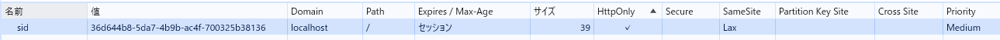
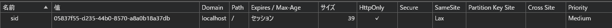

## index.js でdocument.cookie プロパティを console.logで表示する

- 何も表示されない
- クッキーの値に、あらかじめ属性が設定されていたとしても、その属性はこの値には含まれない（テキストのP.591）

## ブラウザの開発者コンソールで http://localhost:3000/ の Cookie を表示する

- あらかじめ設定されていた属性が表示された
  

## ToDo アプリのタブをリロードする

- リロードしてもToDoリストのアイテムやステータスは保持されている

## 同一ブラウザの異なるタブやウィンドウで http://localhost:3000/ を開いて ToDo リストの状態を確認する

- ToDoリストの状態は同じである

## シークレットウィンドウや異なるブラウザで http://localhost:3000/ を開いて ToDo リストの状態を確認する

- ToDoリストの状態は異なる
- Cookieのセッションが違う
  

## http://127.0.0.1:3000/ を開いて ToDo リストの状態を確認する

以下のエラーで表示できない

- このサイトにアクセスできません
- 127.0.0.1 で接続が拒否されました。
