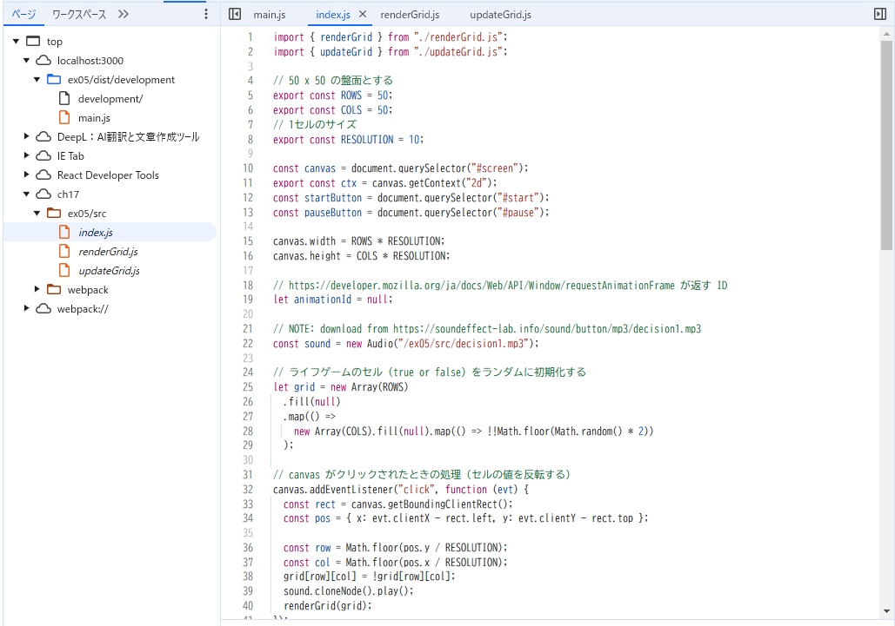
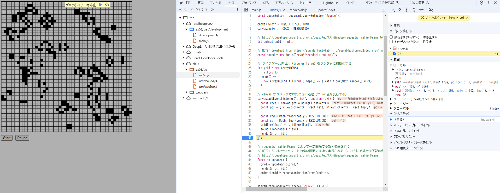

# 開発者ツールで ソース タブ(Chrome, Edge, Safari) または デバッガー タブ(Firefox) を開き、ソースコードファイルがどのように表示されるかを確認しなさい。

ページ一覧にソースディテクトリ(ch17.ex05/src)が表示されており、各ソースファイルを閲覧することができた

# バンドルしたコードの実行中に、バンドル前のソースコードファイルに基づいたブレークポイントの設定や変数の値の確認等のデバッグが可能か確認しなさい。

index.js のcanvas がクリックされたときの処理 にブレークポイントを設定してみた。  
実際にCanvasをクリックすると処理が一時停止した。変数の値の確認も可能となっていた。

